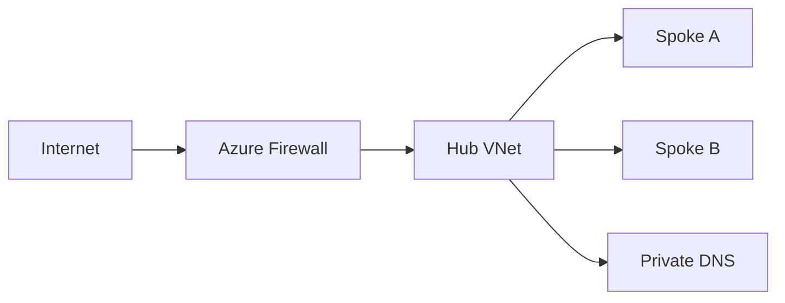

# Azure Hub-Spoke Network

This repository captures an enterprise networking pattern with centralized security services and isolated spoke landing zones.

```mermaid
flowchart LR
    A[Internet] --> B[Azure Firewall]
    B --> C[Hub VNet]
    C --> D[Spoke A]
    C --> E[Spoke B]
    C --> F[Private DNS]
```
